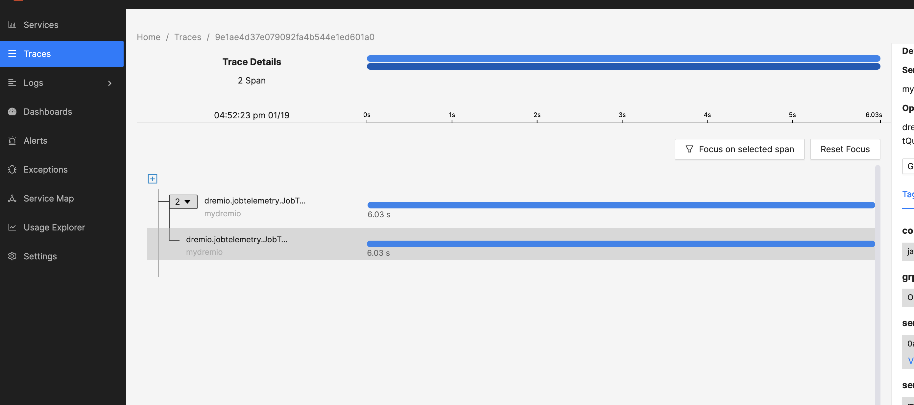

# dremio opentelemetry learning

> with signoz


## running

* starting signoz

```code
cd signoz
docker compose -f clickhouse-setup/docker-compose.yaml up -d
```

* starting dremio 

```code
docker-compose up -d
```

## view tracing result

open localhost:3301


